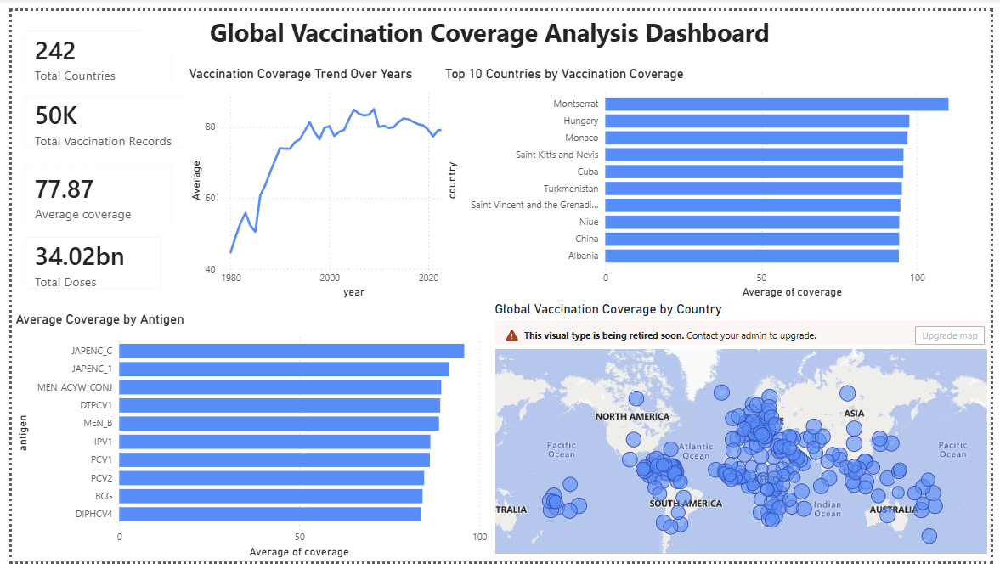

# Global Vaccination Coverage Analysis

## Overview

This project analyzes global vaccination coverage data using Python, MySQL, and Power BI.

The goal is to understand vaccination trends, compare countries, analyze vaccine coverage by antigen, and visualize global vaccination patterns.

## Tools Used

- Python
- Pandas
- MySQL
- Power BI
- SQL

## Workflow

Raw Dataset
↓
Data Cleaning using Python
↓
Data Storage in MySQL
↓
SQL Analysis Queries
↓
Power BI Dashboard

## Dashboard

## Key Insights

- Average global vaccination coverage is around 78%.
- Vaccination coverage has increased over the years.
- Some countries show higher vaccination coverage compared to others.
- Different vaccine antigens have varying coverage levels.
- Geographic visualization shows worldwide vaccination distribution.
